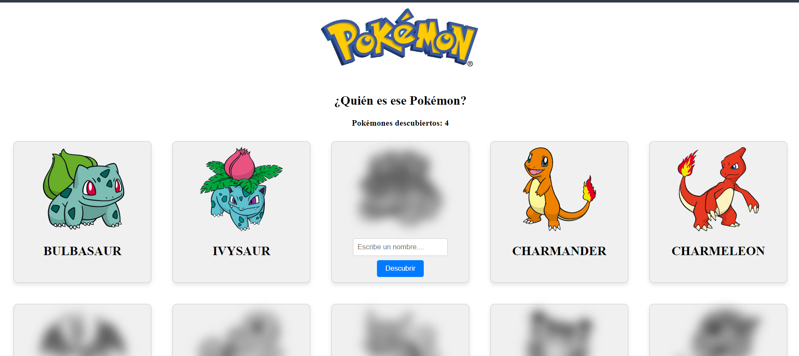

Desarrolladora : Ana Celeste Pérez
- [¿Quién es ese Pokémon?](#quién-es-ese-pokémon)
  - [Características](#características)
  - [Instalación](#instalación)
  - [Requerimientos](#requerimientos)

# ¿Quién es ese Pokémon?
`Descripción:`  
"¿Quién es ese Pokémon?" es una aplicación interactiva construida con Vue.js que permite a los usuarios descubrir Pokémon al adivinar sus nombres. Cada Pokémon tiene su imagen oculta hasta que el usuario adivina correctamente su nombre. La aplicación también muestra un contador del número de Pokémon descubiertos.

## Características 
-Listado de Pokémon: La aplicación muestra una lista de Pokémon con sus imágenes ocultas.

-Adivinanza de Nombres: Los usuarios pueden escribir el nombre de un Pokémon para intentar descubrirlo.

-Estado del Pokémon: Cada Pokémon tiene un estado que indica si ha sido descubierto o no.

-Contador de Descubrimientos: Muestra el número total de Pokémon descubiertos.

-Interfaz Amigable: Diseño responsivo y estilizado para una experiencia de usuario atractiva.

## Instalación

`Clona el repositorio:` git clone "url/del/repositorio/"

`npm install` Instala las dependencias (incluyendo Axios).

`npm run serve` Inicia la aplicación.

## Requerimientos
`1. Usar las directivas para enlazar variables del estado con el template.`

Se utilizan las directivas de Vue como v-bind y v-model para enlazar las variables de estado con el template, permitiendo la actualización dinámica del DOM basado en los cambios del estado. (1 Punto)

`2. Importar y ocupar componentes hijos que reciban datos a través de props.`

 El componente PokemonCard se importa y utiliza en App.vue, y recibe datos a través de props. Esto permite la reutilización de componentes y la modularidad del código. (1 Punto)

`3. Renderizar dinámicamente componentes hijos usando el v-for`.

Utilizamos v-for para renderizar una lista de componentes PokemonCard dinámicamente basada en los datos obtenidos de la API. (1 Punto)

`4. Usar los eventos para agregar interacciones en la aplicación y enlazarlos con métodos locales.`

Los eventos se utilizan para manejar interacciones del usuario, como la adivinanza de nombres de Pokémon. Estos eventos están enlazados con métodos locales que actualizan el estado de la aplicación. (1 Punto)

`5. Comunicar componentes hijos con su padre para la ejecución de un método.`

El componente hijo PokemonCard se comunica con el componente padre App.vue a través de eventos emitidos (@pokemon-descubierto). Esto permite que el padre ejecute métodos basados en las acciones del hijo. (1 Punto)

`6. Usar la renderización condicional de elementos para mostrar u ocultar contenido.`

La aplicación utiliza directivas como v-if para renderizar condicionalmente elementos del DOM, mostrando u ocultando contenido basado en el estado de la aplicación. (1 Punto)

`7. Asignar condicionalmente estilos o clases por medio del style y class binding.`

Se utilizan bindings de clase y estilo (:style y :class) para asignar estilos condicionalmente, como desenfocar la imagen de un Pokémon hasta que sea descubierto. (1 Punto)

`8. Utilizar Axios para el consumo de la API.` 

La aplicación usa Axios para hacer solicitudes HTTP y obtener datos de la API de Pokémon, asegurando la comunicación eficiente con el backend. (1 Punto)

`9. Hacer uso del ciclo de vida para ejecutar código al cargar la aplicación.`

Se utiliza el ciclo de vida de Vue (created) para ejecutar el método fetchPokemons y cargar los datos de la API cuando el componente se crea. (1 Punto)

`10. Utilizar computed properties para el procesamiento de datos del estado.`

Las computed properties se utilizan para procesar datos del estado de manera eficiente, como calcular el número de Pokémon descubiertos en pokemonCount. (1 Punto).